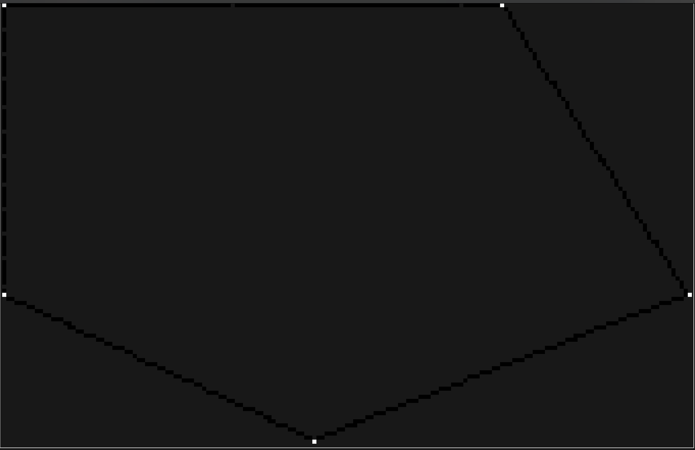
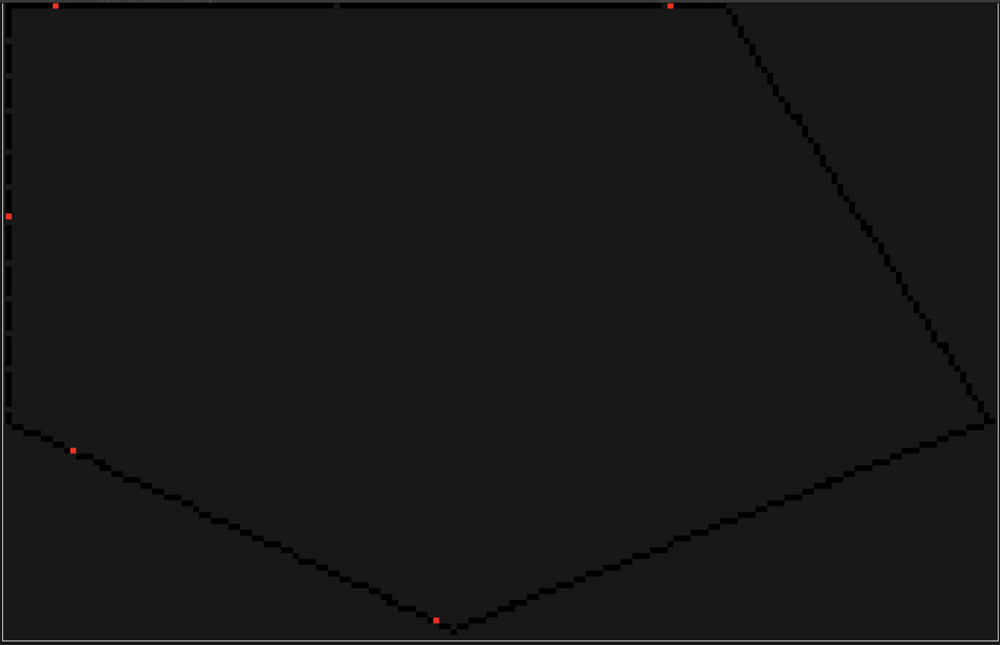

[](https://github.com/DavJCosby/sled/actions/workflows/rust.yml)

# Spatial LED (SLED)
SLED is a rust library for creating spatial lighting effects for individually addressable LED strips. API ergonomics and performance are top priorities for this project. That said, SLED is still in its early stages of development which means there is plenty of room for improvement in both categories.

What SLED **does** do:
- It exposes an API that lets you:
	- Modify virtual LED colors depending on each LED's position, distance, direction, line segment, etc;
	- Output that color data in a simple, contiguous data structure for your own usage;
	- Filter LEDs by their spatial properties to pre-compute important sets;
- Additionally, some tools are provided to help you build functional apps faster (you may opt-out with compiler features):
	- `Driver` - Pack draw/compute logic into a Driver to simplify to the process of swapping between effects, or changing effect settings at runtime. 
	- `Scheduler` - Lightweight tool to schedule redraws at a fixed rate, powered by [spin_sleep](https://github.com/alexheretic/spin-sleep).
What SLED **does not do**:
- It does not interface directly with your GPIO pins to control your LED hardware. Each project will be different, so it's up to you to bring your own glue. Check out my personal [raspberry pi implementation](https://github.com/DavJCosby/rasp-pi-setup) to get an idea of what that might look like.
- It does not allow you to represent your LEDs in 3D space. Could be a fun idea in the future, but it's just not planned for the time being.
## The Basics
### Setup
To create a Sled struct, you need to create a configuration file and provide its path to the constructor:
```rust
use sled::Sled;
fn main() -> Result<(), sled::SledError> {
    let mut sled = Sled::new("/path/to/config.toml")?;
    Ok(())
}
```

A configuration file explains the layout of your LED strips in 2D space. This is used to pre-calculate some important information, speeding up complex draw calls.

 Example .toml file:
 ```toml
 center_point = [0.0, 0.5]
 density = 30.0

 [[line_segment]]
 start = [-2.0, 0.0]
 end = [0.5, -1.0]

 [[line_segment]]
 start = [0.5, -1.0]
 end = [3.5, 0.0]

 [[line_segment]]
 start = [3.5, 0.0]
 end = [2, 2]

 [[line_segment]]
 start = [2.0, 2]
 end = [-2.0, 2]
 [[line_segment]]
 start = [-2.0, 2]
 end = [-2.0, 0.0]
 ```
 * `center_point` is a static reference point you can use to speed up draw calls. At initialization, directions, distances, etc relative to this point are pre-calculated for each Led.
 * `density` represents how many LED's per unit we can expect for the line segments below. If one or more LED strip has a different density for whatever reason, you can override this default for each `[[line_segment]]`.
 * Add as many `[[line_segment]]` tags as you need to represent your scene.
### Drawing
Once you have your Sled struct, you can start drawing to it right away! Here’s a taste of some of the things SLED lets you do:

**Set all vertices to white:**
```rust
sled.set_vertices(Rgb::new(1.0, 1.0, 1.0));
```


**Set all LEDs 2 units away from the `center_point` to red:**
```rust
sled.set_at_dist(2.0, Rgb::new(1.0, 0.0, 0.0))?;
```


**Set each LED using a function of its direction from point `(2, 1)`:**
```rust
 sled.map_by_dir_from(Vec2::new(2.0, 1.0), |dir| {
     let red = (dir.x + 1.0) * 0.5;
     let green = (dir.y + 1.0) * 0.5;
     Rgb::new(red, green, 0.5)
 });
```


**Dim one of the walls by 75%:**
```rust
sled.modulate_segment(3, |led| led.color * 0.25)?;
```


**Set all LEDs within the overlapping areas of two different circles to blue:**
```rust
let circle_1: Filter = sled.get_within_dist_from(
        2.0,
        Vec2::new(1.0, 0.5)
    );
    
let circle_2: Filter = sled.get_within_dist_from(
	2.5,
	Vec2::new(-1.0, 1.5)
);

let overlap = circle_1.and(&circle_2);
sled.set_filter(&overlap, Rgb::new(0.0, 0.0, 1.0));
```

For more examples, see the documentation comments on the Sled struct.