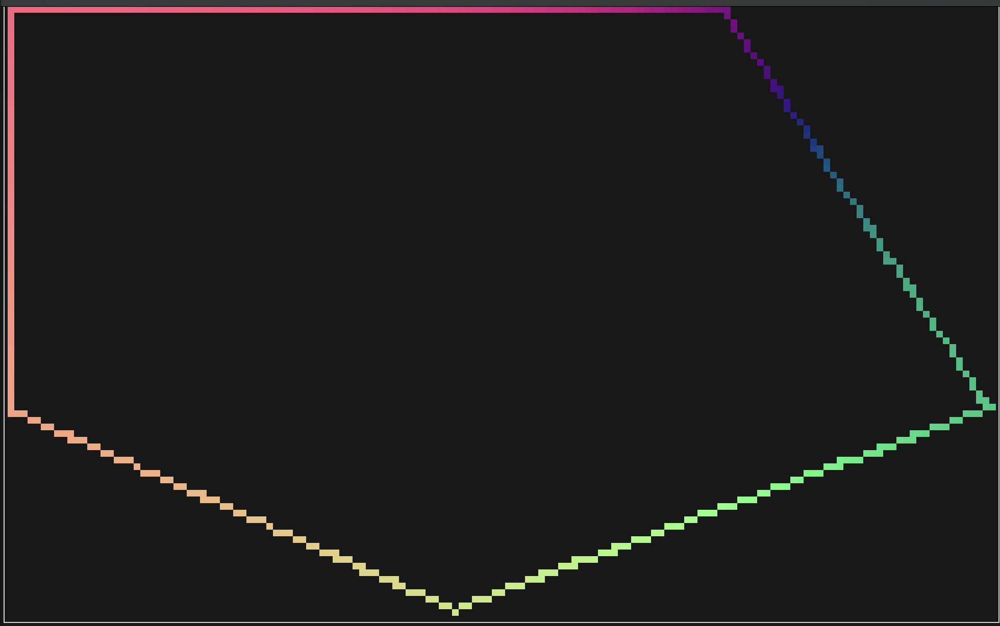
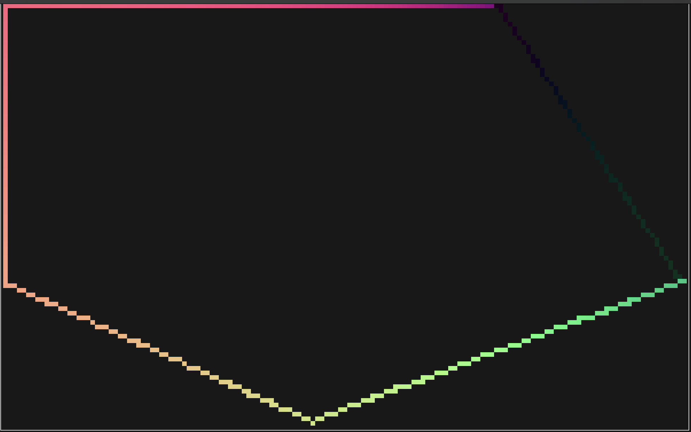
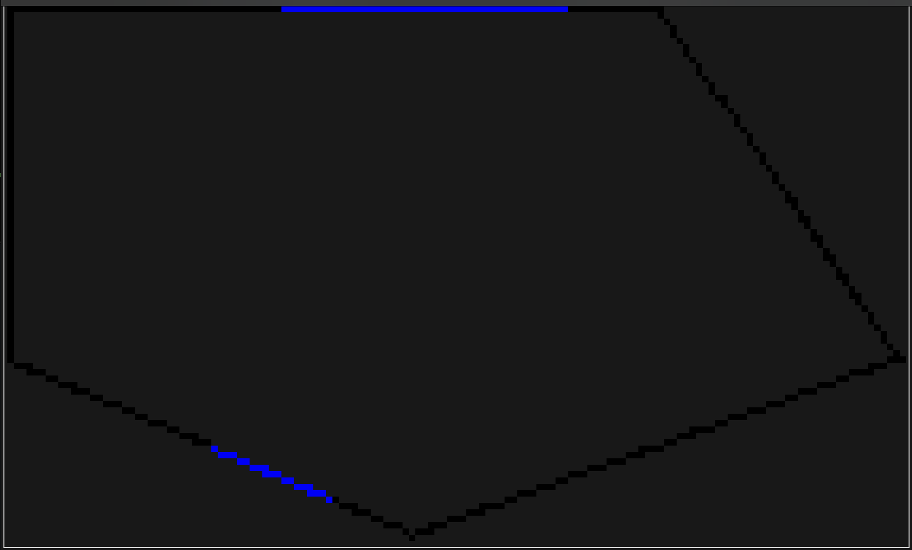
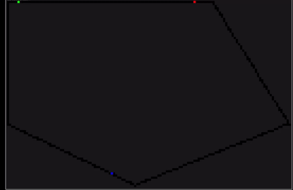

[](https://github.com/DavJCosby/sled/actions/workflows/rust.yml)

# Spatial LED (SLED)
SLED is a rust library for creating spatial lighting effects for individually addressable LED strips. API ergonomics and performance are top priorities for this project. That said, SLED is still in its early stages of development which means there is plenty of room for improvement in both categories.

What SLED **does** do:
- It exposes an API that lets you:
	- Modify virtual LED colors depending on each LED's position, distance, direction, line segment, etc;
	- Output that color data in a simple, contiguous data structure for your own usage;
	- Filter LEDs by their spatial properties to pre-compute important sets;
- Additionally, some tools are provided to help you build functional apps faster (you may opt-out with compiler features):
	- `Driver` - Pack draw/compute logic into a Driver to simplify to the process of swapping between effects, or changing effect settings at runtime. 
	- `Scheduler` - Lightweight tool to schedule redraws at a fixed rate, powered by [spin_sleep](https://github.com/alexheretic/spin-sleep).

What SLED **does not** do:
- It does not interface directly with your GPIO pins to control your LED hardware. Each project will be different, so it's up to you to bring your own glue. Check out my personal [raspberry pi implementation](https://github.com/DavJCosby/rasp-pi-setup) to get an idea of what that might look like.
- It does not allow you to represent your LEDs in 3D space. Could be a fun idea in the future, but it's just not planned for the time being.
## The Basics
In absence of an official guide, this will serve as a basic introduction to Sled. From here, you can use the documentation comments to learn what else Sled offers.
### Setup
To create a Sled struct, you need to create a configuration file and provide its path to the constructor:
```rust
type Rgb8 = Rgb<_, u8>;

use sled::Sled;
fn main() -> Result<(), sled::SledError> {
    let mut sled = Sled::new::<Rgb8>("/path/to/config.toml")?;
    Ok(())
}
```

A configuration file explains the layout of your LED strips in 2D space. This is used to pre-calculate some important information, speeding up complex draw calls.

 Example .toml file:
 ```toml
 center_point = [0.0, 0.5]
 density = 30.0

 [[line_segment]]
 start = [-2.0, 0.0]
 end = [0.5, -1.0]

 [[line_segment]]
 start = [0.5, -1.0]
 end = [3.5, 0.0]

 [[line_segment]]
 start = [3.5, 0.0]
 end = [2, 2]

 [[line_segment]]
 start = [2.0, 2]
 end = [-2.0, 2]
 [[line_segment]]
 start = [-2.0, 2]
 end = [-2.0, 0.0]
 ```
 * `center_point` is a static reference point you can use to speed up draw calls. At initialization, directions, distances, etc relative to this point are pre-calculated for each Led.
 * `density` represents how many LED's per unit we can expect for the line segments below. If one or more LED strip has a different density for whatever reason, you can override this default for each `[[line_segment]]`.
 * Add as many `[[line_segment]]` tags as you need to represent your scene.
### Drawing
Once you have your Sled struct, you can start drawing to it right away! Here’s a taste of some of the things SLED lets you do:

**Set all vertices to white:**
```rust
sled.set_vertices(Rgb::new(1.0, 1.0, 1.0));
```

> Note that this is a custom terminal UI visualization that is not packaged as part of the sled crate. It is ultimately up to you to decide how to visualize your LEDs, Sled just handles the computation.

**Set all LEDs 2 units away from the `center_point` to red:**
```rust
sled.set_at_dist(2.0, Rgb::new(1.0, 0.0, 0.0))?;
```


**Set each LED using a function of its direction from point `(2, 1)`:**
```rust
 sled.map_by_dir_from(Vec2::new(2.0, 1.0), |dir| {
     let red = (dir.x + 1.0) * 0.5;
     let green = (dir.y + 1.0) * 0.5;
     Rgb::new(red, green, 0.5)
 });
```


**Dim one of the walls by 75%:**
```rust
sled.modulate_segment(3, |led| led.color * 0.25)?;
```


**Set all LEDs within the overlapping areas of two different circles to blue:**
```rust
let circle_1: Filter = sled.within_dist_from(
        2.0,
        Vec2::new(1.0, 0.5)
    );
    
let circle_2: Filter = sled.within_dist_from(
	2.5,
	Vec2::new(-1.0, 1.5)
);

let overlap = circle_1.and(&circle_2);
sled.set_filter(&overlap, Rgb::new(0.0, 0.0, 1.0));
```

For more examples, see the documentation comments on the Sled struct.

## Output

Once you’re ready to display these colors, you’ll probably want them packed in a nice contiguous array of RGB values. There are a few methods available to pack the information you need.

```rust
// collect an ordered vector of Rgbs, 32-bits/channel
let colors_f32: Vec<Rgb> = sled.colors();
// collect an ordered vector of Rgbs, 8-bits/channel (overhead for conversion)
let colors_u8: Vec<Rgb<_, u8>> = sled.colors();

let positions: Vec<Vec2> = sled.positions();

let colors_and_positions: Vec<(Rgb, Vec2)> =
    sled.colors_and_positions();
```

# Advanced Features
For basic applications, the Sled struct gives you plenty of power. Odds are though, you'll want to create more advanced effects that might be time or user-input driven. A few optional (enabled by default, opt-out by disabling their compiler features) tools are provided to streamline that process.

## Drivers
Drivers are useful for encapsulating everything you need to drive a lighting effect all in one place. Here's an example of what a simple one might look like:

```rust
let mut driver = Driver::new();

driver.set_startup_commands(|_sled, buffers, _filters| {
    let colors = buffers.create_buffer::<Rgb>("colors");
    colors.push(Rgb::new(1.0, 0.0, 0.0));
    colors.push(Rgb::new(0.0, 1.0, 0.0));
    colors.push(Rgb::new(0.0, 0.0, 1.0));
    Ok(())
});

driver.set_draw_commands(|sled, buffers, _filters, time_info| {
    sled.set_all(Rgb::new(0.0, 0.0, 0.0));

    let elapsed = time_info.elapsed.as_secs_f32();
    let colors = buffers.get_buffer::<Rgb>("colors")?;
    let num_colors = colors.len();

    for i in 0..num_colors {
        let alpha = i as f32 / num_colors as f32;
        let angle = elapsed + (TAU * alpha);
        sled.set_at_angle(angle, colors[i])?;
    }

    Ok(())
});
```
To start using the Driver, give it ownership over a Sled using `.mount()` and use `.step()` to manually refresh it.
```rust
let sled = Sled::new("path/to/config.toml")?;
driver.mount(sled); // sled gets moved into driver here.

loop {
    driver.step();
}
```


If you need to retrieve ownership of your sled later, you can do:
```rust
let sled = driver.dismount();
```

`.set_startup_commands()` - Define a function or closure to run when `driver.mount()` is called. Grants mutable control over Sled, BufferContainer, and Filters.

`set_draw_commands()` - Define a function or closure to run every time `driver.step()` is called. Grants mutable control over Sled, and immutable access to BufferContainer, Filters, and TimeInfo.

`set_compute_commands()` - Define a function or closure to run every time `driver.step()` is called, scheduled right before draw commands. Grants immutable access to Sled, mutable control over BufferContainer and Filters and immutable access to TimeInfo.

If you don't Drivers for your project, you can bring down your binary and shed a dependency or two by disabling the `drivers` compiler feature.

### Buffers
A driver exposes a data structure called `BufferContainer`. A BufferContainer essentially acts as a HashMap of `&str` keys to Vectors of any type you choose to instantiate. This is particularly useful for passing important data and settings in to the effect.

It's best practice to create buffers with startup commands, and then modify them either through compute commands or from outside the driver depending on your needs.

```rust
fn startup(sled: &mut Sled, buffers: &mut BufferContainer, _filters: &mut Filters) -> Result<(), SledError> {
    let wall_toggles: &mut Vec<bool> = buffer.create_buffer("wall_toggles");
    let wall_colors: &mut Vec<Rgb> = buffer.create_buffer("wall_colors");
    let some_important_data = buffer.create_buffer::<MY_CUSTOM_TYPE>("important_data");
    Ok(())
}

driver.set_startup_commands(startup);
```

To maniplate buffers from outside driver, just do:
```rust
let buffers: &BufferContainer = driver.buffers();
// or
let buffers: &mut BufferContainer = driver.buffers_mut();
```

Using a BufferContainer is relatively straightforward.
```rust
let draw_commands = |sled, buffers, _, _| {
    let wall_toggles = buffers.get_buffer::<bool>("wall_toggles")?;
    let wall_colors = buffers.get_buffer::<Rgb>("wall_colors")?;
    let important_data = buffers.get_buffer::<MY_CUSTOM_TYPE>("important_data")?;

    for i in 0..wall_toggles.len() {
        if wall_toggles[i] == true {
            sled.set_segment(i, wall_colors[i])?;
        } else {
            sled.set_segment(i, Rgb::new(0.0, 0.0, 0.0))?;
        }
    }
    
    Ok(())
}
```

If you need to mutate buffer values:
```rust
// Mutable reference to the whole buffer
let buffer_mut = buffers.get_buffer_mut::<bool>("wall_toggles")?;

// Modify just one item
buffers.set_buffer_item("wall_toggles", 1, false);

// Mutable reference to just one item
let color: &mut Rgb = buffers.get_buffer_item_mut("wall_colors", 2)?;
*color /= 2.0;
```

### Filters
For exceptionally performance-sensitive applications, Filters can be used to predefine important LED regions. Imagine for example that we have an incredibly expensive mapping function that will only have a visible impact on the LEDs within some radius $R$ from a given point $P$.

Rather than checking the distance of each LED from that point every frame, we can instead do something like this:

```rust
let startup_commands = |sled, buffers, filters| {
    let area_filter: Filter = sled.get_within_dist_from(5.0, Vec2::new(-0.25, 1.5));

    filters.set("area_of_effect", area);
    Ok(())
};

let draw_commands = |sled, buffers, filters, _| {
    let area_filter = filters.get("area_of_effect")?;
    sled.map_filter(area_filter, |led| {
        // expensive computation
    });
    Ok(())
};
```
Most `.get` methods on sled will return a Filter, but if you need more precise control you can do something like this:
```rust
let even_filter = sled.filter(|led| led.index() % 2 == 0);
```

I imagine this feature will get less love than buffers, but I can still see a handful of scenarios where this can be very useful for some users. In a future version this may become an opt-in compiler feature.

## Scheduler
The Scheduler struct makes it super easy to schedule redraws at a fixed rate.

```rust
let mut scheduler = Scheduler::new(120.0);

scheduler.loop_forever(|| {
    driver.step();
});
```
Scheduler utilizes [spin_sleep](https://crates.io/crates/spin_sleep/) to minimize the high CPU usage you typically see when you spin to wait for the next update.

Here are a few other methods that you might also consider:

```rust
// loops until false is returned
scheduler.loop_while_true(|| {
    // -snip-
    return true;
});

// loops until an error of any type is returned
scheduler.loop_until_err(|| {
    // -snip-
    Ok(())
});

// best for where you don't wanna pass everything through a closure
loop {
    // -snip-
    scheduler.sleep_until_next_frame();
}
```

If you don't need the Scheduler struct and would like to keep spin_sleep's dependencies out of your project, you can disable the `scheduler` compiler feature.